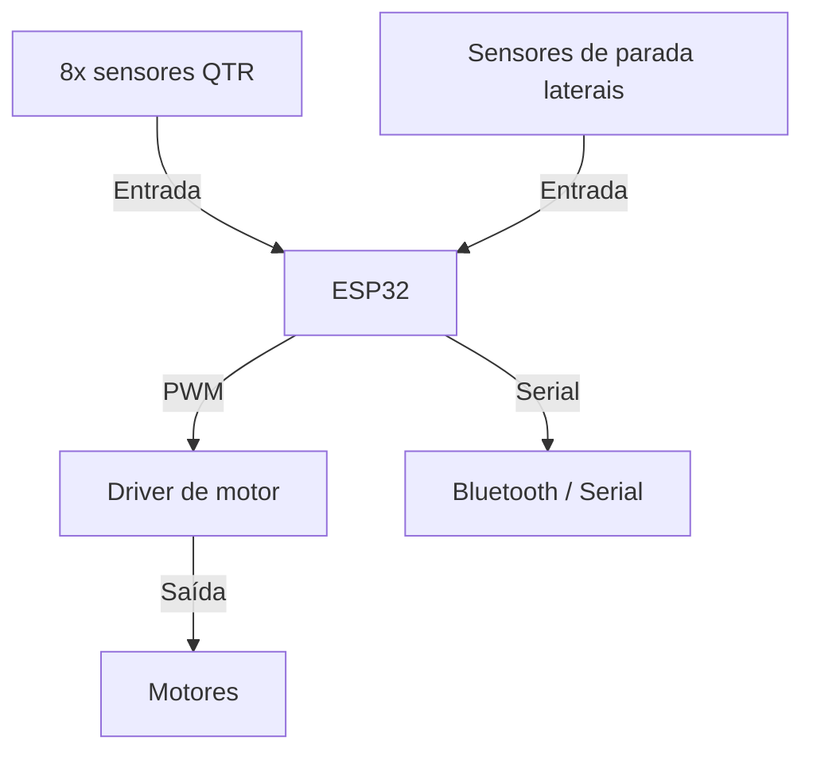

# seguidor-de-linha

Projeto de robô seguidor de linha.
Este módulo apresenta um sistema prático com sensores QTR, controle e mapeamento de pista.

## O que você vai aprender

- Como sensores QTR detectam a linha.
- Como controlar o robô usando PD/PID.
- Como interpretar paradas e curvas na pista.
- Como usar um exemplo de ESP32 com Bluetooth.

## Organização do módulo

- `01-qtr-sensors`: calibração e leitura dos sensores.
- `02-algoritmo-pid`: cálculo de erro e ajuste de velocidade.
- `03-mapeamento-pista`: tratamento de paradas e curvas.

## Esquema geral de entradas e saídas

Esse diagrama mostra o fluxo principal de I/O:

- os sensores QTR e de parada são entradas ao ESP32.
- o ESP32 processa os valores e calcula o comando de saída.
- os sinais PWM vão para o driver de motor.
- o driver alimenta os motores.
- o Bluetooth/serial permite ajuste e monitoramento.

## Arquivo principal

O exemplo `seguidor-principal.ino` inclui:

- configuração de pinos.
- calibração de sensores QTR.
- leitura contínua dos sensores.
- controle de motores com PD.
- comandos Bluetooth para ajustar parâmetros.

## Como usar

1. Abra `seguidor-principal.ino` no Arduino IDE ou PlatformIO.
2. Selecione a placa ESP32 e a porta correta.
3. Conecte os sensores QTR e o driver de motor.
4. Envie o sketch para a placa.
5. Use o monitor serial para verificar saídas.

## Observações importantes

- Calibrar os sensores antes de iniciar é essencial.
- Ajuste `KP` e `KD` com testes na pista.
- O controle PD corrige a direção sem usar o termo integral.
- A leitura correta da linha é a base do sistema.

## Exercícios

- Execute o exemplo `qtr_exemplo.ino` e compare com o projeto completo.
- Anote como a posição da linha é convertida em comando de motor.
- Ajuste os parâmetros e veja o efeito no robô.

## Referências

- Livro: "Getting Started with Arduino" de Massimo Banzi.
